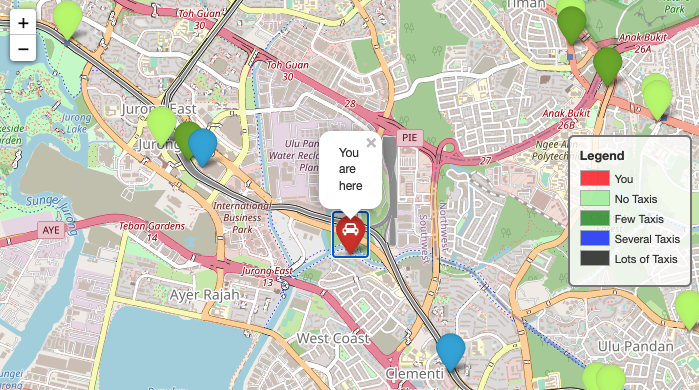
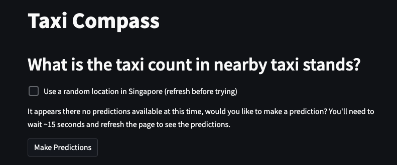

# Hello 👋
Welcome to the taxi-compass project created during the 24-week LeWagon
Part Time Data Science bootcamp (Sep '21 - Jan '22). What you see here is a
working version of a solution we put together to address
the question that many taxi drivers face: "Where should I go to find riders?" 🤔

## 🚕 Finding Empty Taxi Stands
In order to answer that question, we rely on publicly available data in
Singapore, ranging from taxi coordinates, to rainfall and even MRT disruptions. The
solution uses all this data to make a prediction on the expected amount
of available taxis in the vecinity of nearby taxi stands. This way, taxi drivers can make decisions
on where to drive towards and which taxi stands to avoid. 🙌

Try the app *now* by clicking this [LINK](https://taxi-compass.herokuapp.com/). Note that you'll need to grant location access to your browser.

# Technical Details 📻

## ☁️ Cloud Infra
* GCP is where the backend is hosted, mainly relying on Cloud Functions for the
many API calls (serverless with cron).
* Big Query is the table technology we used
to store the data we are scraping (all available taxi coordinates once per minute).
* Machine learning model is loaded on a GCP bucket and is called to make predictions on-demand.

## 📺  Front End
* Frontend was developed using Streamlit and Folium, hosted on Heroku.
Streamlit is very easy to use and for a simple solution like this one, the performance is acceptable.

## 🧠 Predictions
* Machine Learning predictions run on XGBoost Classifier to deal with class imbalance.
* The model has been trained offline using a week of data. Ideally, you would re-train and re-upload the model every week or so, especially if you are hitting the holidays or some nation wide event that changes the movement of large amounts of people #Omicron.

## 🚨 Warning
You actually cannot run this code locally, most of the files are actually running in GCP or Heroku. Plus you'll need GCP credentials (not included here).

## ⚡️ We are Live
This app is live, so if you are a driver looking for empty taxi stands nearby
or a rider, looking for lots of available taxis, do give it a try! Link is >>>>>> [HERE](https://taxi-compass.herokuapp.com/) <<<<<<<

# Caveats 🕵️‍♀️
## 💰 Cloud is expensive
The cost of periodic calls to cloud services piles up quickly, so we are no longer running the predictions every 15 minutes. If you want to use the app,
you'll need to make the predictions on demand (takes about 20 seconds) and then refresh the page
to see the predictions.

## 📍 Geolocation
Because of geolocation in your browser, this app only works in Singapore. If you want
to test this out from overseas, please tick the box to obtain a random location in Singapore before starting.
This way you'll get to experience it from anywhere in the world!

## 🦖  Sleeping Dynos
Heroku free dynos go to sleep when unused, so you might experience very slow response if you launch the app when is unused for over 30 minutes.
Just be patient, it will load eventually! Once its warm, speed should be way better.

### Hope you enjoy it! 🌈🦄
### *Team Taxi-Compass*
